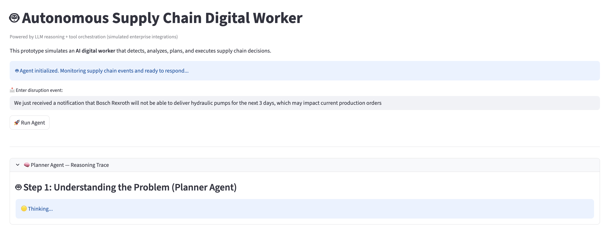
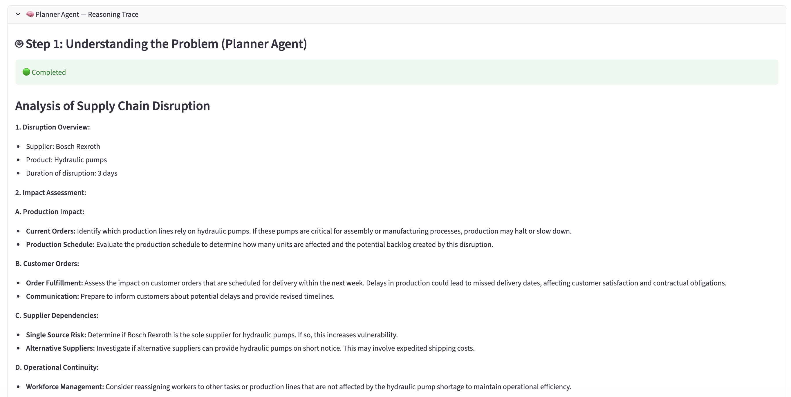
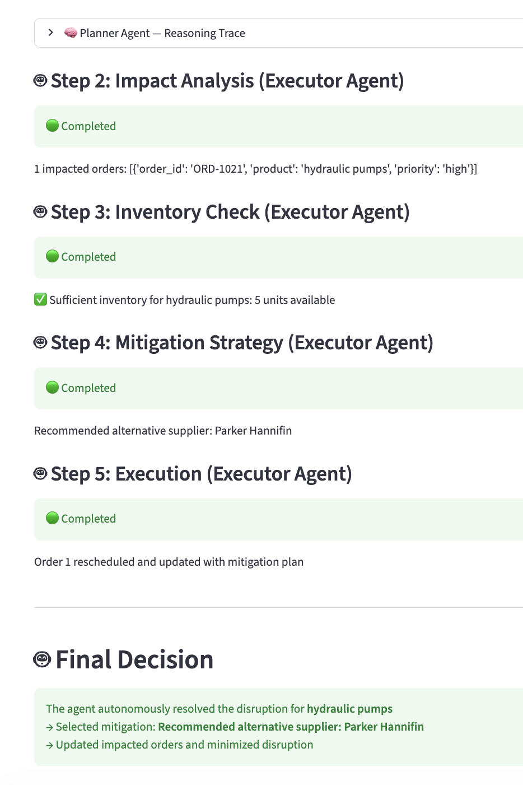

# 🤖 Autonomous Supply Chain Digital Worker

An agentic AI prototype simulating how enterprise digital workers detect, analyze, plan, orchestrate, and execute actions across supply chain workflows.

Built as a high-level proof of concept inspired by emerging enterprise agentic AI systems such as IFS Loops.

---

## 🚀 Overview

This project demonstrates a simplified AI operations control tower capable of:

- Detecting supply chain disruptions
- Analyzing operational impact
- Orchestrating workflows
- Executing mitigation actions
- Providing observability into AI reasoning and decisions

The prototype combines:
- LLM-based reasoning
- Workflow orchestration concepts
- Simulated enterprise integrations
- Human-readable observability

---

## 🧠 Product Vision

The goal is to simulate how AI systems evolve from:

> "AI that provides insights"

to:

> "AI that operates as a digital worker"

This prototype focuses on enterprise operational workflows where AI agents coordinate actions across systems such as ERP, supplier management, inventory systems, and production operations.

---

## 🏭 Example Scenario

> “Bosch Rexroth cannot deliver hydraulic pumps for the next 3 days, impacting production orders.”

The agent autonomously:

1. Understands the disruption
2. Analyzes impacted orders
3. Checks inventory levels
4. Finds mitigation options
5. Selects alternative suppliers
6. Updates operational workflows

---

# 🖥️ Demo Screenshots

## 1️⃣ Event Trigger + Agent Initialization

Shows the disruption event entering the system and the digital worker being activated.



---

## 2️⃣ Planner Agent — Reasoning & Operational Analysis

The Planner Agent performs disruption understanding, impact analysis, supplier dependency analysis, and operational continuity reasoning.



---

## 3️⃣ Executor Agent — Workflow Orchestration & Resolution

The Executor Agent executes mitigation workflows, checks inventory, selects alternative suppliers, updates orders, and generates final operational decisions.



---

## ⚙️ Core Features

### 🧠 Agent Reasoning Layer
- LLM-based disruption analysis
- Multi-step workflow reasoning
- Confidence scoring
- Expandable reasoning traces

### 🔄 Workflow Orchestration
- Sequential execution flow
- Retry + failure handling
- Planner vs Executor agent simulation
- Tool orchestration

### 🏢 Enterprise Workflow Simulation
- Supplier disruptions
- Inventory shortages
- ERP-style workflow actions
- Production impact analysis

### 📊 Business Impact Metrics
- Orders saved
- Delay reduction
- Operational continuity insights

---

## 🧩 System Architecture

The prototype is structured into three conceptual layers:

### 1. Reasoning Layer
LLM-powered understanding and planning.

### 2. Orchestration Layer
Controls workflow execution and agent coordination.

### 3. Execution Layer
Simulated enterprise systems and operational actions.

---

## 🛠️ Tech Stack

- Python
- Streamlit
- OpenAI API
- Agentic workflow orchestration concepts

---

## ▶️ Running Locally

### 1. Clone the repository

```bash
git clone https://github.com/skyplon/agentic-supply-chain-digital-worker.git
cd agentic-supply-chain-digital-worker
```

### 2. Create virtual environment

```bash
python3 -m venv venv
source venv/bin/activate
```

### 3. Install dependencies

```bash
pip install -r requirements.txt
```

### 4. Add OpenAI API key

Create a `.env` file:

```env
OPENAI_API_KEY=your_api_key_here
```

### 5. Run the application

```bash
streamlit run app.py
```

---

## 🧪 Example Inputs

```text
We just received a notification that Bosch Rexroth will not be able to deliver hydraulic pumps for the next 3 days, which may impact current production orders
```

```text
Inventory shortage detected for electronic control units impacting production schedules
```

---

## 🔮 Future Improvements

- Multi-agent orchestration using LangGraph
- Real ERP integrations
- RAG-based operational memory
- Human approval workflows
- Persistent agent memory/state
- LangSmith observability integration

---

## ⚠️ Disclaimer

This project is a prototype designed to simulate agentic AI workflow orchestration concepts and does not integrate with real enterprise systems.

---

## 👤 Author

Juan Navarrete  
Senior Product Manager — AI/ML Solutions  
Building enterprise AI systems and agentic workflow experiences.